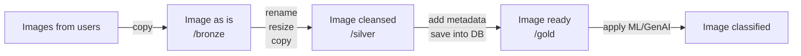
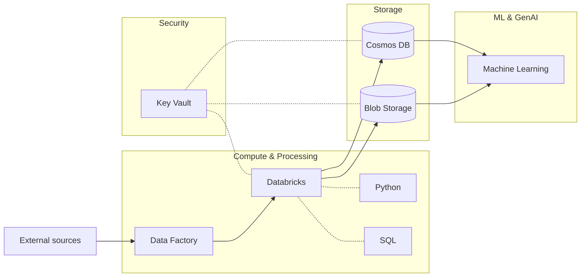

# Part 1 - System Design & Architecture

## Pecularities of the use case

### Goal
Assume data classification

### Data to be used
Coming from heterogenous sources

### Data type
Images, not text or structures

## End-to-end pipeline

### Data ingestion
User-uploaded images are first stored as-is in the /bronze folder.
This raw layer preserves the original files, which is useful for:
- **Investigation**: analyzing issues with the unmodified input.
- **Reprocessing**: rerunning improved preprocessing or models on the exact same data.

#### Trigger
- **Schedule**: +: simple to set up; predictable; easy to monitor; -: potentially latency and waste of compute 
- **Event**: +: near RT, scalable, efficient; -: complex and harder to maintain
As a prototype to start with a schedule, and then consider an event trigger.

### Data preprocessing
Images from /bronze are cleaned and standardized before further use.
The processed files are saved in the /silver folder. This step ensures a harmonized dataset by:
- **Renaming**: applying unique, consistent file names.
- **Resizing**: scaling to a maximum side length (e.g. 512 px) while keeping aspect ratio.

### Data enrichment
Preprocessed images are enriched with metadata and model outputs, making them ready for downstream ML/GenAI use.
Collected metadata may include:
- user id,
- upload timestamp,
- ingest timestamp,
- raw name, path, size, width, height,
- cleansed name, path, size, width, height,
- hash checksum,
- model version

### Data storage
- **File storage**: /bronze (raw), /silver (processed), /gold (ready-to-use).
- **Database**: metadata, labels, predictions, lineage, and quality checks.

### Data usage
TBD ML/GenAI applications

### Data maintenance
- **Archiving**: move old raw data from /bronze to cold/archive storage for cost efficiency, while keeping /silver and /gold available for active use
- **Historization**: retain past model predictions and outputs for auditability and reproducibility; can be introduced later once the system matures
- **Manual validation**: integrate a human-in-the-loop review step for low-confidence predictions to improve label quality and model reliability
- **Image formats**: other than jpg?

## Technological stack
Suggested Azure ecosystem for seamless integration.

### Compute & Processing
- **Azure Databricks**: data ingestion, transformation, orchestration, and scheduling
- **Python**: main processing language; versatile and widely supported
- **Azure ML**: classical ML and GenAI model training, deployment, and monitoring

### Storage
- **Azure Blob Storage**: object storage for raw, processed, and prepared images
- **Azure Cosmos DB**: operational database supporting both SQL and NoSQL workloads
- **SQLite**: lightweight option for prototyping and local development

### Security
- **Azure Key Vault**: secure storage of secrets, keys, and private endpoints

### Aditional tools to consider:
- **Azure Data Factory**: pipeline orchestration and connectors for diverse data sources
- **Azure Synapse Analytics**: structured data processing
- **SQL**: quering and data manipilation
- **Microsoft Power BI**: visualization and reporting for statistics, monitoring, and quality checks

## Prototype
A lightweight local prototype can be implemented with Python scripts + SQLite + cron

[Data ingestion](../notebooks/data_ingestion.ipynb)

## High-level architecture

### Scalability
- **Autoscale workers in Databricks**

### Cost control
- **Archiving**: slower but cheaper storage
- **Resizing**: store silver at smaller reolution (512 px)

### Reliability
- **Idemponent transformations**: pipelines retry

## Databricks
### Notebook
### Workflow
### Job