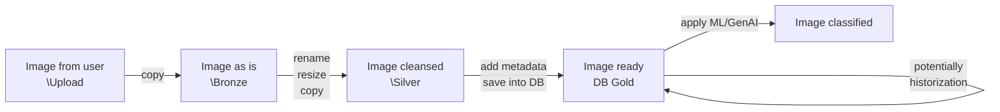
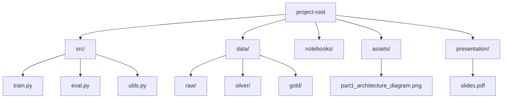
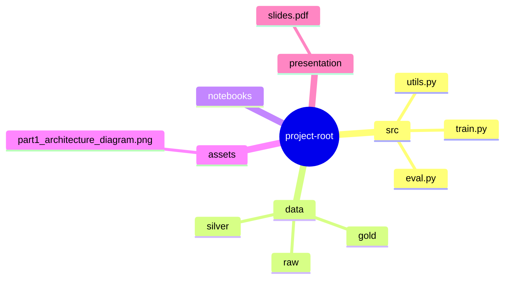

# Part 1 - System Design & Architecture

## End-to-end workflow diagram

## Metadata
The following metadata can be gathered for images:
- user id,
- upload timestamp,
- ingest timestamp,
- raw name, path, size, width, height,
- cleansed name, path, size, width, height

## Technological stack
- **Azure Databricks**: data ingestion, transfer and processing; 
- **Azure Data Factory** Data
- **Python**
- **SQL**
- **Azure ML**

## Storage folder structure

## Databricks

## End-to-end flow
Daily ingestion of user-uploaded product images → preprocessing → enrichment → storage → downstream ML/GenAI.

**Pipeline stages:**
- **Ingestion:** FastAPI upload API + Queue + Object Storage (Bronze)
- **Preprocessing:** Validation, resize (max side 512px), EXIF strip, de-dup (pHash)
- **Enrichment:** CLIP embeddings, OCR, classifier → Delta/SQLite tables
- **Storage & Usage:** Silver (cleaned images), Gold (curated tables), Vector index, Model serving
- **Cross-cutting:** Orchestration (Airflow/Workflows), Monitoring (MLflow), Security (IAM/KMS)

## Diagram (Mermaid)

Sketch an end-to-end pipeline for the described use case (daily ingestion of user-uploaded product images).
● Show how raw images flow through ingestion → preprocessing → enrichment → storage → downstream usage (eg. ML/GenAI applications).
● Describe which tools, frameworks, and services you would use at each stage (e.g., storage, orchestration, monitoring, model deployment) and how they fit together.
● Include a high-level architecture diagram with notes on scalability, cost control, and reliability.
● (Bonus) Show how this could be implemented in a Databricks-based setup.

## understanding the task

there are new images from users, uploaded on daily basis

we need to ingest them and prepare for further usage and processing

lets assume it's a dish classification case

points to consider:
* we expect to have some existing main image pool which we plan to extend with new images

* we ingest images daily
    * schedule or other trigger?

* data preparation
    * rescale to have a maximum side length of 512 pixels
    * add metadata
        * upload date
        * user id

* historization
    * unlikely

* where to store images and labels

* workflow
    * ingest as raw
    * process as rescaled
    * put through ML model and label as labeled
    * manually validate?
    * extend the main image

