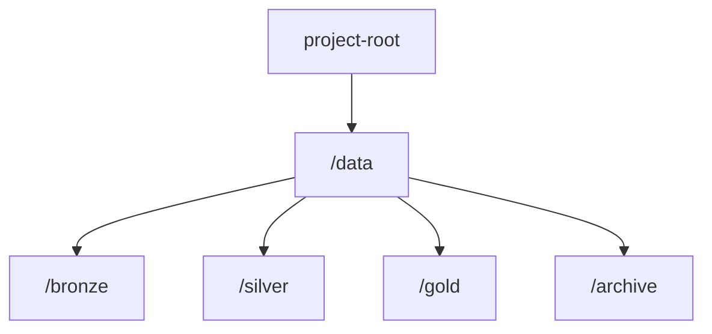

# Part 1 - System Design & Architecture

## End-to-end workflow diagram

## Metadata
The following metadata can be gathered for images:
- user id,
- upload timestamp,
- ingest timestamp,
- raw name, path, size, width, height,
- cleansed name, path, size, width, height,
- hash checksum,
- model version

## Technological stack
suggestion to Azure ecosystem for seamless integration
- **Azure Databricks**: data ingestion, transfer and processing; orchestration and scheduling
- **Azure Blob Storage**: data storage
- **Azure Cosmos DB**: database for both sql and nosql
- **Python**: main processing language, versatile and commonly used
- **Azure ML**: GenAI or classical predictive modelling
- **Azure Key Vault**: secrets, private endpoints

more to consider
- **Azure Data Factory**: multiple various connectors, e.g. more external and internal sources
- **Azure Synapse**: structured files/tables processing, e.g. preparation for dashboarding
- **SQLite**: simple and hands-on DB
- **SQL**: quering and data manipilation, e.g. for quick exploratory analysis
- **MS Power BI**: visualization and reporting, e.g. statistics or quality checks

## Storage folder structure

## Trigger
### Schedule
**+**: simple to set up; predictable; easy to monitor

**-**: potentially latency and waste of compute 
### Event
**+**: near RT, scalable, efficient

**-**: complex and harder to maintain

As a prototype to start with a schedule, and then consider an event trigger.

## Options to consider
- **Archiving**
- **Historization**: allows to see former model inferences, but seems to be overhead at the starting phase
- **Manual validation**: Could be integrated as a human-in-the-loop step for low-confidence predictions.

## Python prototype
A lightweight local prototype can be implemented with Python scripts + SQLite + cron

## Cost control
- **Archiving**: slower but cheaper storage

Scalability, cost control, reliability ➕

Scalability: autoscale workers (Databricks jobs), partition data by date, deduplicate with hash.

Cost control: archive Bronze after 30 days, store Silver at smaller resolution (512 px), recompute only on checksum change.

Reliability: make preprocessing idempotent, use retries + DLQ for failed messages, track lineage (raw → silver → gold).

## Databricks
### Notebook

### Workflow
### Job

● Sketch an end-to-end pipeline for the described use case (daily ingestion of user-uploaded product images).
● Show how raw images flow through ingestion → preprocessing → enrichment → storage → downstream usage (eg. ML/GenAI applications).
● Describe which tools, frameworks, and services you would use at each stage (e.g., storage, orchestration, monitoring, model deployment) and how they fit together.
● Include a high-level architecture diagram with notes on scalability, cost control, and reliability.
● (Bonus) Show how this could be implemented in a Databricks-based setup.

What is “autoscale workers” in Databricks?

In Databricks, your jobs run on a cluster (a set of virtual machines).

Driver node → coordinates the work.

Worker nodes → actually do the processing (e.g., resize images, run Spark jobs).

Autoscale workers means:

You set a minimum and maximum number of workers.

Databricks automatically adds more workers when the workload is heavy.

And removes workers when the workload is light.

Why it matters

Scalability: If 10,000 images arrive today, the cluster scales up (e.g., 2 → 10 workers). If only 100 images arrive tomorrow, it scales down again.

Cost control: You don’t pay for idle machines — only what you use.

Reliability: Jobs finish faster under heavy load, without manual tuning.

Define cluster:

Min workers = 2

Max workers = 10

Normal day: only 2 workers are running.

Big upload day: Databricks scales up automatically to 10 workers, processes faster.

After work is done: scales back down to 2.